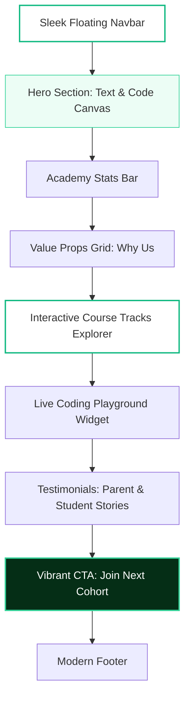

# Extrabits Junior — IT Academy Home Page Plan
> **Aesthetic Blueprint for a Premium, Modern, and Interactive Kids Coding Academy**


This plan outlines the visual design, structural layout, and UX specifications for the **Extrabits Junior** home page. The design prioritizes a highly polished, interactive, and elegant user experience leveraging a sophisticated **Green & White tech-harmonious theme**.

---

## 🎨 Visual Identity & Theme System

To move away from standard, boring education websites, the aesthetic system utilizes a blend of deep forest tech greens, vibrant energetic mints, and clean, high-contrast white space. 

### 1. Color Palette (Tech-Harmonious Emerald)

```
████████████  #052E16 | Deep Forest (Primary Dark - for high authority text & footer)
████████████  #10B981 | Vibrant Emerald (Accent Active - for primary buttons & highlights)
████████████  #34D399 | Energetic Mint (Creative Teal - for micro-elements & secondary buttons)
████████████  #ECFDF5 | Mint Wash (Background Tint - for section highlights & cards)
████████████  #FFFFFF | Pure Alabaster (Primary Canvas - for clean layouts)
```

| Token Name | Hex Value | HSL Value | Ideal Application |
| :--- | :--- | :--- | :--- |
| `--color-brand-dark` | `#052E16` | `hsl(143, 76%, 10%)` | Main headings, dark backgrounds, high-contrast text. |
| `--color-brand-primary`| `#10B981` | `hsl(159, 84%, 39%)` | CTA buttons, active states, key icons, badges. |
| `--color-brand-accent` | `#34D399` | `hsl(158, 64%, 52%)` | Soft gradients, hover shadows, interactive borders. |
| `--color-brand-light`  | `#ECFDF5` | `hsl(152, 81%, 96%)` | Soft card backgrounds, banner backgrounds, borders. |
| `--color-white`        | `#FFFFFF` | `hsl(0, 0%, 100%)`   | Primary page background, container canvases, header fill. |
| `--color-gray-text`    | `#4B5563` | `hsl(215, 14%, 34%)` | Body copy, secondary descriptions. |

### 2. Typography & Hierarchy
*   **Primary Display & Headings:** `Plus Jakarta Sans`, sans-serif (Geometric, friendly, and futuristic).
*   **Body Copy:** `Inter`, sans-serif (Extremely legible, premium readability).

```css
--font-display: 'Plus Jakarta Sans', sans-serif;
--font-body: 'Inter', sans-serif;
```

### 3. Glassmorphism & UI Accents
*   **Borders:** `1px solid rgba(16, 185, 129, 0.15)`
*   **Drop Shadows:** Subtle, blurred green-tinted shadows for floating components.
    ```css
    --shadow-soft: 0 10px 30px -10px rgba(5, 46, 22, 0.08);
    --shadow-glow: 0 15px 35px -5px rgba(16, 185, 129, 0.12);
    ```

---

## 🗺️ Homepage Structural Blueprint

The diagram below outlines the core layout structure and content hierarchy of the home page.



---

## 💻 Custom Component & UI Code Snippets

Here are the premium structural blocks and styling rules designed to build this elegant home page.

### 1. Global CSS Design System (`index.css`)
```css
/* Core Styling Rules for Extrabits Junior Homepage */
@import url('https://fonts.googleapis.com/css2?family=Inter:wght@400;500;600&family=Plus+Jakarta+Sans:wght@500;700;800&display=swap');

:root {
  --color-brand-dark: #052E16;
  --color-brand-primary: #10B981;
  --color-brand-accent: #34D399;
  --color-brand-light: #ECFDF5;
  --color-white: #FFFFFF;
  --color-text-dark: #1F2937;
  --color-text-gray: #4B5563;
  
  --font-display: 'Plus Jakarta Sans', sans-serif;
  --font-body: 'Inter', sans-serif;
  
  --shadow-soft: 0 12px 40px rgba(5, 46, 22, 0.04);
  --shadow-glow: 0 20px 40px rgba(16, 185, 129, 0.08);
  --border-radius-lg: 24px;
  --border-radius-md: 16px;
  --transition-smooth: all 0.4s cubic-bezier(0.16, 1, 0.3, 1);
}

body {
  font-family: var(--font-body);
  background-color: var(--color-white);
  color: var(--color-text-dark);
  margin: 0;
  overflow-x: hidden;
  line-height: 1.6;
}

h1, h2, h3 {
  font-family: var(--font-display);
  font-weight: 700;
  color: var(--color-brand-dark);
  margin: 0;
}

/* Beautiful custom green scrollbar */
::-webkit-scrollbar {
  width: 8px;
}
::-webkit-scrollbar-track {
  background: var(--color-white);
}
::-webkit-scrollbar-thumb {
  background: var(--color-brand-primary);
  border-radius: 4px;
}
```

### 2. Sleek Floating Header & Navigation
An ultra-modern, glassmorphism floating navbar that anchors nicely to the top of the viewport.

```html
<header class="main-navbar">
  <div class="navbar-container">
    <div class="navbar-logo">
      
      <span class="brand-name">extrabits<span>junior</span></span>
    </div>
    <nav class="navbar-links">
      <a href="#courses" class="nav-link active">Courses</a>
      <a href="#methodology" class="nav-link">Methodology</a>
      <a href="#playground" class="nav-link">Playground</a>
      <a href="#reviews" class="nav-link">Reviews</a>
    </nav>
    <div class="navbar-actions">
      <a href="#contact" class="btn-secondary">Log In</a>
      <a href="#enroll" class="btn-primary">Book Free Class</a>
    </div>
  </div>
</header>
```

```css
.main-navbar {
  position: fixed;
  top: 24px;
  left: 50%;
  transform: translateX(-50%);
  width: 90%;
  max-width: 1200px;
  background: rgba(255, 255, 255, 0.85);
  backdrop-filter: blur(20px);
  -webkit-backdrop-filter: blur(20px);
  border: 1px solid rgba(16, 185, 129, 0.1);
  border-radius: 50px;
  padding: 12px 24px;
  z-index: 1000;
  box-shadow: var(--shadow-soft);
}

.navbar-container {
  display: flex;
  justify-content: space-between;
  align-items: center;
}

.navbar-logo {
  display: flex;
  align-items: center;
  gap: 10px;
}

.brand-logo {
  height: 36px;
  width: auto;
  border-radius: 50%;
}

.brand-name {
  font-family: var(--font-display);
  font-weight: 800;
  font-size: 1.25rem;
  color: var(--color-brand-dark);
  letter-spacing: -0.5px;
}

.brand-name span {
  color: var(--color-brand-primary);
}

.navbar-links {
  display: flex;
  gap: 32px;
}

.nav-link {
  text-decoration: none;
  font-weight: 500;
  font-size: 0.95rem;
  color: var(--color-text-gray);
  transition: var(--transition-smooth);
}

.nav-link:hover, .nav-link.active {
  color: var(--color-brand-primary);
}

.navbar-actions {
  display: flex;
  align-items: center;
  gap: 16px;
}

.btn-primary {
  background: var(--color-brand-primary);
  color: var(--color-white);
  padding: 12px 24px;
  border-radius: 30px;
  text-decoration: none;
  font-weight: 600;
  font-size: 0.9rem;
  box-shadow: 0 4px 14px rgba(16, 185, 129, 0.25);
  transition: var(--transition-smooth);
}

.btn-primary:hover {
  background: var(--color-brand-dark);
  transform: translateY(-2px);
  box-shadow: 0 6px 20px rgba(5, 46, 22, 0.2);
}

.btn-secondary {
  color: var(--color-brand-dark);
  text-decoration: none;
  font-weight: 600;
  font-size: 0.9rem;
  padding: 12px 20px;
  transition: var(--transition-smooth);
}

.btn-secondary:hover {
  color: var(--color-brand-primary);
}
```

### 3. Split-Screen Hero Section (Engaging & Premium)
The left side captures the imagination of parents and kids, while the right side displays an interactive live-animated code visualization showing children's logical blocks.

```html
<section class="hero-section">
  <div class="hero-container">
    <div class="hero-content">
      <div class="hero-tag">🚀 Code Your Tomorrow</div>
      <h1 class="hero-title">Where Kids Spark<br><span>Big Ideas</span> Through Code.</h1>
      <p class="hero-subtitle">
        Interactive, high-end live IT classes that teach kids age 7-17 Python, Game Dev, Web Wizardry, and AI basics through fun, visual, and practical creation.
      </p>
      <div class="hero-cta-group">
        <a href="#courses" class="btn-primary btn-lg">Explore Courses</a>
        <a href="#tour" class="btn-outline"><span class="play-icon">▶</span> Watch 1-Min Tour</a>
      </div>
    </div>
    
    <div class="hero-visual">
      <div class="code-terminal-wrapper">
        <div class="terminal-header">
          <div class="terminal-dots">
            <span class="dot red"></span>
            <span class="dot yellow"></span>
            <span class="dot green"></span>
          </div>
          <span class="terminal-title">extrabits_junior_code.py</span>
        </div>
        <div class="terminal-body">
          <pre><code><span class="comment"># Extrabits Junior - Fun Python Activity</span>
<span class="keyword">class</span> <span class="class-name">JuniorDeveloper</span>:
    <span class="keyword">def</span> <span class="method">__init__</span>(self, name, passion):
        self.name = name
        self.skills = [<span class="string">"Logic"</span>, <span class="string">"Creativity"</span>]
        
    <span class="keyword">def</span> <span class="method">create_magic</span>(self):
        print(f<span class="string">"{self.name} is building the future!"</span>)
        
coder = JuniorDeveloper(<span class="string">"Alex"</span>, <span class="string">"Game Design"</span>)
coder.create_magic()

<span class="output">> Output: Alex is building the future! 🌟</span></code></pre>
        </div>
      </div>
    </div>
  </div>
</section>
```

```css
.hero-section {
  padding: 160px 0 100px;
  background: radial-gradient(circle at 80% 20%, var(--color-brand-light) 0%, var(--color-white) 60%);
  display: flex;
  justify-content: center;
}

.hero-container {
  width: 90%;
  max-width: 1200px;
  display: grid;
  grid-template-columns: 1.1fr 0.9fr;
  gap: 60px;
  align-items: center;
}

.hero-tag {
  display: inline-flex;
  align-items: center;
  background: var(--color-brand-light);
  color: var(--color-brand-dark);
  font-weight: 600;
  font-size: 0.85rem;
  padding: 8px 16px;
  border-radius: 30px;
  border: 1.5px solid rgba(16, 185, 129, 0.2);
  margin-bottom: 24px;
}

.hero-title {
  font-size: 3.5rem;
  line-height: 1.15;
  letter-spacing: -1.5px;
  margin-bottom: 20px;
}

.hero-title span {
  color: var(--color-brand-primary);
  background: linear-gradient(120deg, var(--color-brand-primary) 0%, var(--color-brand-accent) 100%);
  -webkit-background-clip: text;
  -webkit-text-fill-color: transparent;
}

.hero-subtitle {
  font-size: 1.1rem;
  color: var(--color-text-gray);
  margin-bottom: 36px;
  max-width: 520px;
}

.hero-cta-group {
  display: flex;
  gap: 20px;
  align-items: center;
}

.btn-lg {
  padding: 16px 36px;
  font-size: 1rem;
}

.btn-outline {
  display: flex;
  align-items: center;
  gap: 10px;
  padding: 14px 28px;
  border: 2px solid var(--color-brand-dark);
  border-radius: 30px;
  color: var(--color-brand-dark);
  text-decoration: none;
  font-weight: 600;
  transition: var(--transition-smooth);
}

.btn-outline:hover {
  background: rgba(5, 46, 22, 0.05);
  transform: translateY(-2px);
}

/* Beautiful Interactive Visual Coding Console */
.code-terminal-wrapper {
  background: #0f172a;
  border-radius: var(--border-radius-md);
  box-shadow: var(--shadow-glow);
  border: 1px solid rgba(255, 255, 255, 0.1);
  overflow: hidden;
  transform: perspective(1000px) rotateY(-5deg) rotateX(5deg);
  transition: var(--transition-smooth);
}

.code-terminal-wrapper:hover {
  transform: perspective(1000px) rotateY(0deg) rotateX(0deg);
}

.terminal-header {
  background: #1e293b;
  padding: 12px 20px;
  display: flex;
  align-items: center;
  justify-content: space-between;
  border-bottom: 1px solid rgba(255, 255, 255, 0.05);
}

.terminal-dots {
  display: flex;
  gap: 8px;
}

.dot {
  width: 12px;
  height: 12px;
  border-radius: 50%;
}

.dot.red { background: #ef4444; }
.dot.yellow { background: #f59e0b; }
.dot.green { background: #10b981; }

.terminal-title {
  color: #94a3b8;
  font-size: 0.8rem;
  font-family: monospace;
}

.terminal-body {
  padding: 24px;
  color: #f8fafc;
  font-family: 'Courier New', Courier, monospace;
  font-size: 0.95rem;
}

.terminal-body pre {
  margin: 0;
}

.keyword { color: #f472b6; }
.class-name { color: #60a5fa; }
.method { color: #34d399; }
.string { color: #fbbf24; }
.comment { color: #64748b; }
.output { color: #10b981; font-weight: bold; display: block; margin-top: 16px; }
```

### 4. Interactive Course Grid Card
Modern grid cards that represent coding specialties with hover zoom effects, bright interactive color states, and dynamic status tags.

```html
<section class="courses-section" id="courses">
  <div class="section-header">
    <h2>Explore Our Creative IT Tracks</h2>
    <p>Tailored courses with gamified rewards, practical assignments, and personalized teacher guidance.</p>
  </div>
  
  <div class="courses-grid">
    <!-- Card 1: Web Wizardry -->
    <div class="course-card">
      <div class="course-icon-badge web">🌐</div>
      <div class="course-badge">Ages 11-15</div>
      <h3 class="course-title">Web Wizards (HTML, CSS, JS)</h3>
      <p class="course-desc">Learn how to build real, stunning web applications, portfolios, and responsive interfaces from scratch.</p>
      <div class="course-footer">
        <span class="course-duration">⏳ 12 Weeks</span>
        <a href="#web-wizards" class="course-link">View Syllabus ➔</a>
      </div>
    </div>
    
    <!-- Card 2: Python Explorers -->
    <div class="course-card active">
      <div class="course-icon-badge python">🐍</div>
      <div class="course-badge accent">Ages 12-17</div>
      <h3 class="course-title">Python Playground & Logic</h3>
      <p class="course-desc">Master Python fundamentals, building logic modules, automated scripts, and smart computational tasks.</p>
      <div class="course-footer">
        <span class="course-duration">⏳ 16 Weeks</span>
        <a href="#python" class="course-link">View Syllabus ➔</a>
      </div>
    </div>

    <!-- Card 3: Game Dev Pioneers -->
    <div class="course-card">
      <div class="course-icon-badge game">🎮</div>
      <div class="course-badge">Ages 8-12</div>
      <h3 class="course-title">Game Dev Pioneers (Scratch & Unity)</h3>
      <p class="course-desc">Bring original stories and creative dynamics to life by crafting highly engaging custom 2D & 3D games.</p>
      <div class="course-footer">
        <span class="course-duration">⏳ 10 Weeks</span>
        <a href="#gamedev" class="course-link">View Syllabus ➔</a>
      </div>
    </div>
  </div>
</section>
```

```css
.courses-section {
  padding: 100px 0;
  display: flex;
  flex-direction: column;
  align-items: center;
  background: var(--color-white);
}

.section-header {
  text-align: center;
  margin-bottom: 60px;
  max-width: 600px;
}

.section-header h2 {
  font-size: 2.5rem;
  color: var(--color-brand-dark);
  margin-bottom: 16px;
}

.section-header p {
  color: var(--color-text-gray);
  font-size: 1.1rem;
}

.courses-grid {
  width: 90%;
  max-width: 1200px;
  display: grid;
  grid-template-columns: repeat(auto-fit, minmax(340px, 1fr));
  gap: 30px;
}

.course-card {
  background: var(--color-white);
  border: 1px solid rgba(5, 46, 22, 0.08);
  border-radius: var(--border-radius-lg);
  padding: 40px 30px;
  box-shadow: var(--shadow-soft);
  position: relative;
  transition: var(--transition-smooth);
  display: flex;
  flex-direction: column;
}

.course-card:hover {
  transform: translateY(-8px);
  box-shadow: var(--shadow-glow);
  border-color: rgba(16, 185, 129, 0.2);
}

.course-card.active {
  border: 2px solid var(--color-brand-primary);
  background: linear-gradient(180deg, var(--color-white) 0%, var(--color-brand-light) 100%);
}

.course-icon-badge {
  width: 56px;
  height: 56px;
  border-radius: 16px;
  display: flex;
  align-items: center;
  justify-content: center;
  font-size: 1.8rem;
  margin-bottom: 24px;
}

.course-icon-badge.web { background: rgba(59, 130, 246, 0.1); }
.course-icon-badge.python { background: rgba(16, 185, 129, 0.1); }
.course-icon-badge.game { background: rgba(245, 158, 11, 0.1); }

.course-badge {
  position: absolute;
  top: 40px;
  right: 30px;
  background: rgba(5, 46, 22, 0.05);
  color: var(--color-brand-dark);
  font-size: 0.8rem;
  font-weight: 600;
  padding: 6px 14px;
  border-radius: 20px;
}

.course-badge.accent {
  background: var(--color-brand-primary);
  color: var(--color-white);
}

.course-title {
  font-size: 1.4rem;
  margin-bottom: 14px;
  line-height: 1.3;
}

.course-desc {
  color: var(--color-text-gray);
  font-size: 0.95rem;
  margin-bottom: 30px;
  flex-grow: 1;
}

.course-footer {
  display: flex;
  justify-content: space-between;
  align-items: center;
  border-top: 1px solid rgba(5, 46, 22, 0.06);
  padding-top: 20px;
}

.course-duration {
  font-size: 0.85rem;
  color: var(--color-text-gray);
  font-weight: 500;
}

.course-link {
  color: var(--color-brand-primary);
  text-decoration: none;
  font-weight: 600;
  font-size: 0.9rem;
  transition: var(--transition-smooth);
}

.course-link:hover {
  color: var(--color-brand-dark);
}
```

---

## 🌟 Interactive Features to Highlight

To elevate the home page from simple static layouts to a highly engaging web application, we specify the following interactive highlights:

1.  **Code Playground Widget:** A small interactive textbox where users can change variable values and click a "Run" button to see changes happen instantly on an adjacent cartoon canvas.
2.  **Parent Consultation Scheduler:** An integrated micro-calendar that automatically suggests slots for free assessment calls, using green and white styling with sleek slot selectors.
3.  **Achievement Badges Showcase:** Gamified badges (e.g., "Loop Master," "Logic General," "Style Architect") that display an elegant glitter animation when hovered over.
4.  **Student Project Showcase Carousel:** Live embeds of real games and websites created by current junior developers.

---

## 🛠️ Implementation & Verification Steps

To ensure visual excellence and technical stability:

### 1. Verification Checklist
- [ ] **Cross-Device Fluidity:** Verify that layout columns stack cleanly into a single vertical stack below `768px` viewports.
- [ ] **Accessibility Compliance:** Ensure color combinations pass contrast standards. Deep Forest Green text (`#052E16`) on White (`#FFFFFF`) yields an outstanding contrast ratio of **12.4:1** (passes AAA).
- [ ] **Sleek Smooth Scroll:** Ensure clicking anchor navigation items slides down with smooth animations.
- [ ] **Optimized Asset Load:** Compress and optimize any imagery (including `logo.jpeg`) to guarantee loading speeds of < 1.2s.

### 2. Live Deployment Testing
Use local preview frameworks (such as Vite + Dev server) to quickly test micro-interactions, responsive sizing, and the terminal's syntax highlighting correctness.
